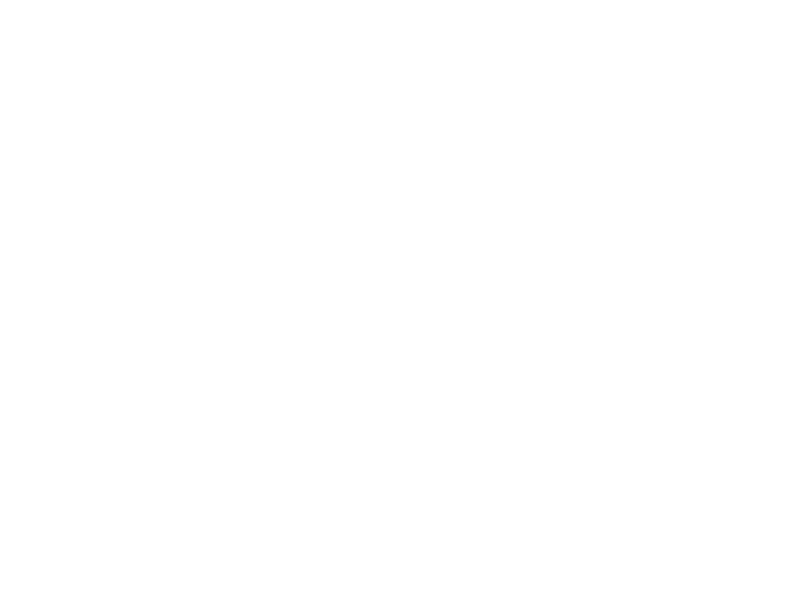

# Novasearch

A tool to calculate the optimal search path in the sky to have the best chance of finding a supernova.



## Table of contents

1. [Installation](#installation)
    - [Package managers](#package-managers)
    - [Build from source](#build-from-source)
        - [Build the binary](#build-the-binary)
        - [With go-task](#with-go-task)
        - [Regenerate the documentation](#regenerate-the-documentation)
2. [Usage](#usage)
3. [Related projects](#related-projects)
    - [Prototype](#prototype)
    - [Webapp](#webapp)
4. [License](#license)

## Installation

For normal users it is recommended to use the precompiled binaries.
(See [Releases](https://github.com/auribuo/novasearch/releases) for the latest version)

### Package managers

Coming soon.

### Build from source

- go version 1.16 or higher
- [swag](https://github.com/swaggo/swag) (for documentation) (optional)
- [go-task](https://taskfile.dev/#/installation) (optional)

#### Build the binary

```bash
git clone https://github.com/auribuo/novasearch.git
cd novasearch
go build # or go install if you want to install it to your $GOPATH/bin folder
```

#### With go-task

```bash
task build # builds the binary and the documentation (needs swag installed)
task install # installs the binary and the documentation (needs swag installed)
task release # builds the release binaries (needs swag installed)
task clean # removes the build artifacts
task uninstall # uninstalls the binary from the $GOPATH/bin folder
```  

#### Regenerate the documentation

```bash
swag init
```

## Usage

### Cli

Get help about the cli

```bash
novasearch --help
```

Get help about a specific command

```bash
novasearch <command> --help
```

Start the api server

```bash
novasearch
```

Start the api server with a custom port and listening on a specific host

```bash
novasearch -p 8080 -h localhost
```

Purge the local catalog cache

```bash
novasearch purge [caches]
```

Generate shell completion scripts

```bash
novasearch completion <bash|zsh|fish|powershell>
# or use the provided script (only works on linux)
./install-completions <bash|zsh|fish|powershell>
```

### Api endpoints

The base url of the api is `http://localhost:8080/api/` by default.

The api has a swagger documentation which can be found at `http://localhost:8080/swagger/index.html` by default.
`http://localhost:8080/` redirects to the swagger documentation.

- `[get]  /api/galaxies` - Get a list of all galaxies
- `[get]  /api/galaxies/{id}` - Get a specific galaxy
- `[post] /api/galaxies` - Filter galaxies based on given data
- `[post] /api/calculate/galaxies/{strategy}` - Calculate the best search path for a given situation using a given
  strategy: random (rng) pick galaxies randomly or using the algorithm (alg)
- `[post] /api/calculate/viewports/{strategy}` - Calculate the best search path for a given situation using a given
  strategy: random (rng) pick galaxies randomly or using the algorithm (alg)

## Related projects

### Prototype

The prototype of this tool was developed in the context of the "Mathematik Modellierungswoche"
at the "Fortbildungsakademie Rechental" in 2023 by a group of students.

The code can be found on [GitHub](https://github.com/auribuo/galaxylist).

### Webapp

Coming soon.

## License

This project is licensed under the MIT License - see the [LICENSE](LICENSE) file for details